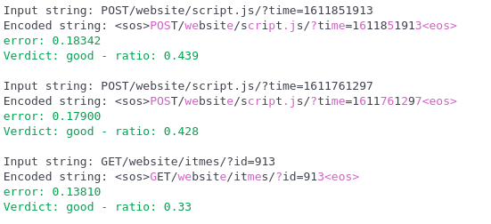
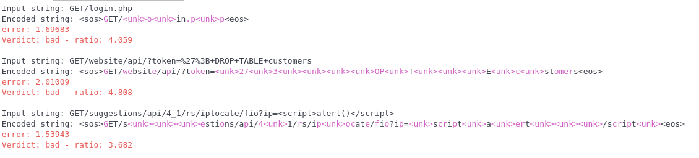
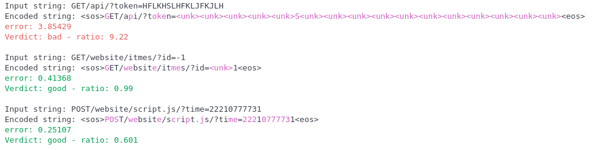

## Deep Learning application in Web Application Firewall task.

Let's imagine hypothetically the website with the following REST API:
* `GET/website/itmes/?id={ID}`
* `POST/website/script.js/?time={TIME}`
* `GET/api/?token={TOKEN}`

Where 
* `ID` is number from 0 to 1000
* `TIME` is a Unix timestamp from 13/09/2020 to 03/03/2021
* `TOKEN` is a lowercase hex string

The task is to build a model which can "learn" the structure of the aforecited requests and alert when the inupt request is not correspond to such structure or even conatins threats.

### Concept
Here we consider an "autoencoder-approach" to the detection of anomalies in HTTP traffic.

Firstly it's important to note that HTTP is not a Natural (read human's) language but we can use some tricks from NLP to work with text data. Such as *embeddings* etc.

Autoencoder is a type of artificial neural network used to learn efficient data codings in an unsupervised manner. The efficinet data coding is learned by so-called *latent space*^

The idea is human-likely: if we can know what is good, we can say what is not good (not necessarily bad, let's consider it as anomaly). 
So if the model knows the good query's structure and can sample from the learned latent space with the error $e_{norm}$, when we try to pass a not-typical query it will sample with the error $e_{anomaly}\gg e_{good}$

### Results

The model deals well with attack detection:
Normal data:

Attack data:

The model deals well with attack detection:
Unnormal (broken) data:
